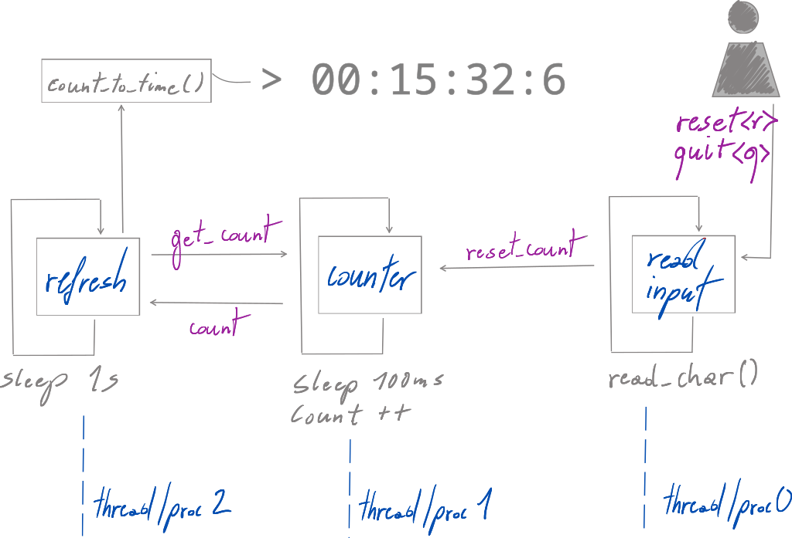
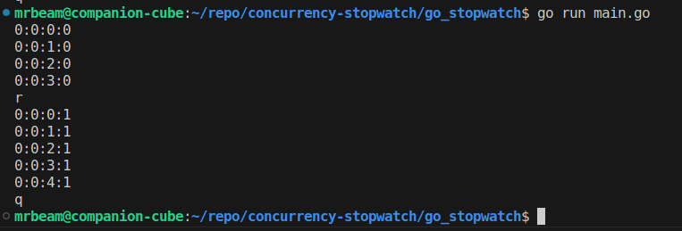

# concurrency-stopwatch
A minimum working example comparing concurrency syntax in Java, C++, Rust, Python, Go and Erlang.

<em>IMPORTANT NOTE: The code implements a toy-stopwatch for didactic reason of syntax comparison between these programming languages using built-ins as much as possible. To achieve this, the stopwatch is not meant to be accurate or address  thread-safety when scaled (especially Java and Python case).</em>

## Process/Thread diagram

## Requirements
* Maximum 3 threads or processes:  
    * counter - fast counting time base for the timer,
    * refresh - console printout stopwatch format HH:MM:SS:Ms by converting counts from counter,
    * read_input - (typically main thread/process) reading user console inputs
        * \<r> reset count
        * \<q> quit,
* counter thread/process must run uninterrupted by signaling from refresh thread/process,
* only allowed to use built-in blocking time counting calls (e.g sleep),
* not allowed to make system time checking calls,
* accuracy of keeping time is of little interest (primary purpose is syntax comparison).
* minimum dependencies,
* minimum lines of code.

## Example

## 
